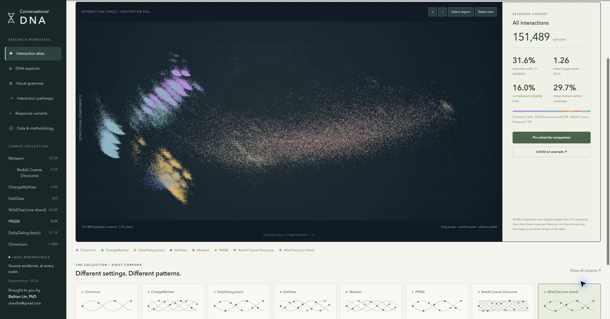

# Conversational DNA

## A Visual Language and Interactive Atlas of Human and AI Dialogue

**Brought to you by Baihan Lin** (doerlbh@gmail.com)

Conversational DNA connects an interactive conversation atlas to speaker strands, communicative moves, response targets, source transcripts, and structural alignment. Explore a collection, select a cohort, unfold an exchange, and inspect its evidence.

Paper on arXiv: https://arxiv.org/abs/2508.07520

Demo video: https://youtu.be/S4SMteXzJb0



**The runnable package contains five labeled synthetic examples.** The paper, screenshot, and video show the separate research build: **151,489 indexed episodes across eight corpora**, drawn from 1,567,618 source records. The research index and raw corpora are not bundled. The sample demonstrates operations, not the empirical findings.

## Run locally

Python 3.11 or newer is required. No GPU or model API key is needed. On macOS/Linux, from this folder:

```bash
bash codes/run_demo.sh
```

Open **http://127.0.0.1:8765**. The script creates `.venv`, installs pinned dependencies, and explicitly selects the bundled sample. Stop with Ctrl-C. The first installation requires internet access. Use `bash codes/run_demo.sh 8766` to choose another port.

On Windows PowerShell:

```powershell
python -m venv .venv
.venv\Scripts\python -m pip install -r requirements.txt
$env:DNA_DATABASE = "$PWD/app/demo.sqlite"
.venv\Scripts\python app/server.py --port 8765
```

Both sample databases are already included. SQLite FTS5 support is required; standard Python distributions normally include it.

## What to try

1. Zoom, pan, recolor, select a map region, and pin a comparison cohort.
2. Open an interaction pathway and unfold its source episode.
3. Select a DNA base, rotate the helix, and toggle measured geometry in Visual grammar.
4. Switch between DNA, lanes, and braid; change episode bounds; retrieve and inspect an alignment.
5. Apply an annotation overlay and export evidence without changing the original source.
6. Compare response variants and read the methods.

The five-point sample is small: some corpus-specific lenses/pathways are empty. Its response alternatives are explicitly synthetic, without empirical participant ratings.

## Credit and licensing

Created by Baihan Lin. [CITATION.cff](CITATION.cff) supplies software citation metadata. Newly written code and synthetic examples use the MIT license. Third-party corpora retain their own terms; see [LICENSE](LICENSE) and the dataset audit. Screenshots and video contain selected source excerpts described in the paper. No raw corpus or full research database is included.
